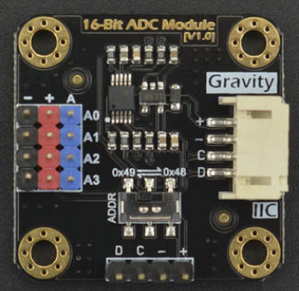
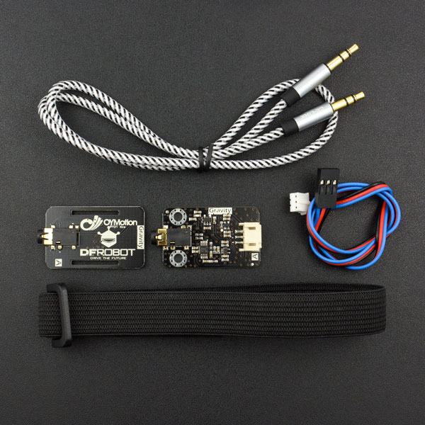
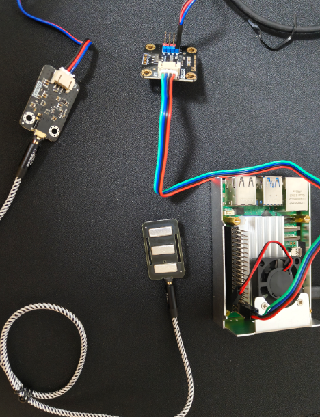
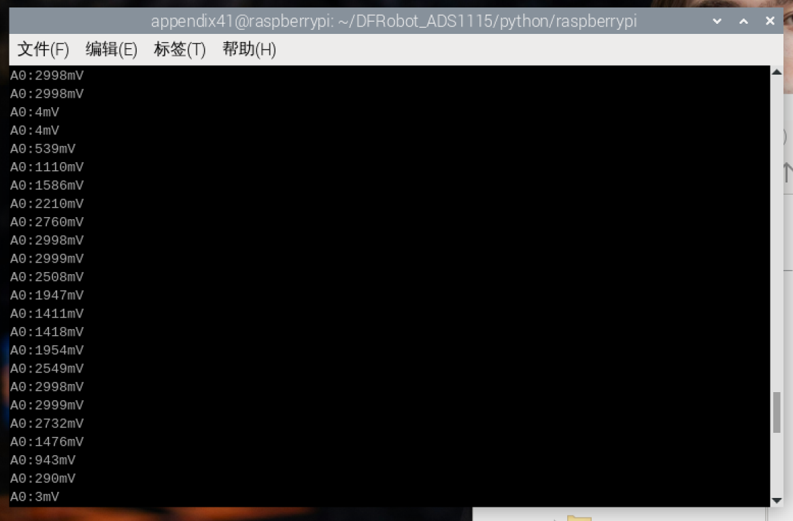
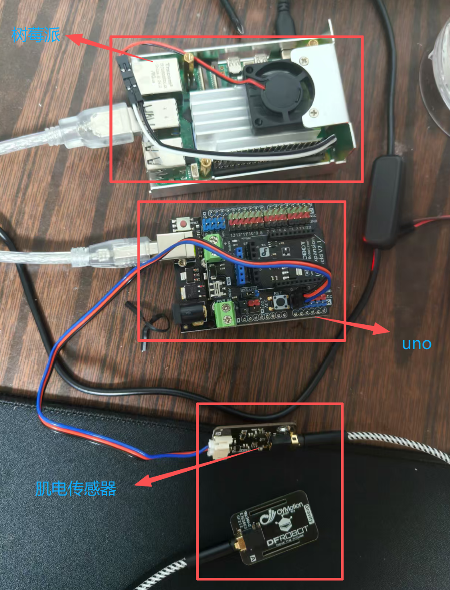
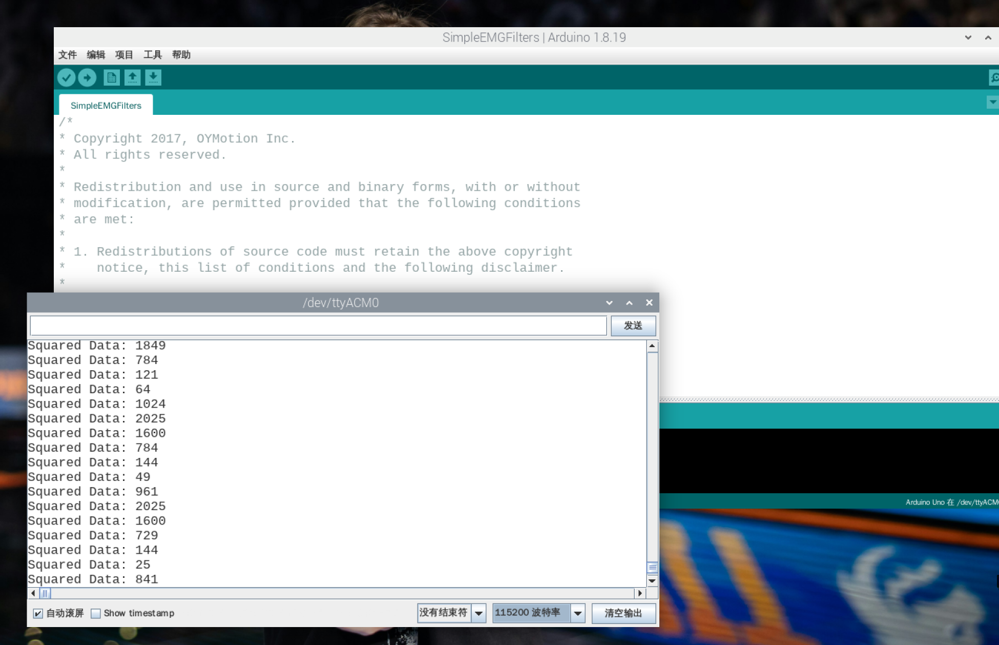

# EMG 肌电模块

这一部分记录 EMG 模块在树莓派上的两种调试方法：

1. 树莓派直接读取 ADS1115（I2C）；
2. Arduino Uno 读取模拟量，再通过 USB 把数据送到树莓派。

两种方法的接线和程序不同，调试时一次只连接其中一种。

## 一、文件说明

```text
EMG/
├─ README.md
├─ 图片
└─ 代码/
   ├─ 方案1_ADC直连/
   │  ├─ DFRobot_ADS1115.py
   │  └─ demo_read_voltage.py
   └─ 方案2_Arduino/
      ├─ SimpleEMGFilters.ino
      ├─ EMGFilters.h
      ├─ EMGFilters.cpp
      └─ LICENSE.EMGFilters.md
```

| 方案 | 主要设备 | 树莓派负责的工作 |
| --- | --- | --- |
| ADS1115 直连 | EMG 模块、DFRobot DFR0553 | 通过 I2C 读 A0 电压 |
| Arduino Uno | EMG 模块、Arduino Uno | 通过 USB 上传程序和查看串口 |

## 二、方案 1：树莓派 + ADS1115




### 1. 硬件连接

DFRobot DFR0553 模块的 I2C 插座丝印为 `+ - C D`，连接如下：

| DFR0553 | 树莓派物理针脚 | 含义 |
| --- | ---: | --- |
| `+` | 1（3.3V） | ADS1115 供电 |
| `-` | 6（GND） | 公共地 |
| `C` | 5（GPIO3/SCL） | I2C 时钟 |
| `D` | 3（GPIO2/SDA） | I2C 数据 |

EMG 模块接 DFR0553 的 A0 三针接口：

```text
EMG VCC/+    → A0 的 +
EMG GND/-    → A0 的 -
EMG SIG/OUT  → A0 的 A
```



地址拨码使用 `0x48`。A1、A2、A3 和 `ALERT/RDY` 在这次单通道读取中不连接。EMG 模块的供电电压以实物标签为准，模拟输出不能超过 ADS1115 的输入范围。

### 2. 树莓派设置

开启 I2C 后，在终端执行：

```bash
sudo apt update
sudo apt install -y python3-smbus i2c-tools
i2cdetect -y 1
```

表格中应能看到 `48`。如果没有 `48`，先检查 `C/SCL`、`D/SDA`、3.3V 和 GND；不要直接运行 Python 程序排错。

### 3. 运行资料中的原始程序

把 `代码/方案1_ADC直连/` 整个文件夹复制到树莓派，例如：

```text
/home/appendix41/EMG/方案1_ADC直连/
```

两个 Python 文件必须在同一目录。进入目录后运行：

```bash
cd /home/appendix41/EMG/方案1_ADC直连
python3 demo_read_voltage.py
```

正常时会持续显示：

```text
A0:1487mV
A0:1502mV
```

放松和收缩时，读数的波动范围应有区别。点击终端窗口后按 `Ctrl+C` 停止；如果 VNC 没有传递组合键，可另开终端执行：

```bash
pkill -f demo_read_voltage.py
```

这份原始驱动每次读取有约 100 ms 的等待，只适合确认 I2C、供电和 EMG 输出，不能当作完整高速肌电采集程序。该方案没有串口波特率。

## 三、方案 2：树莓派 + Arduino Uno

### 1. 硬件连接

```text
EMG VCC/+       → Arduino Uno 5V
EMG GND/-       → Arduino Uno GND
EMG SIG/OUT     → Arduino Uno A0
Arduino Uno USB-B → 树莓派 USB-A
```

本方案不使用 ADS1115，也不连接树莓派 GPIO。EMG 是模拟输出模块，所以没有 TX/RX 接线。


### 2. 放置 Arduino 代码

将下面三个源文件放在同一个 Arduino 工程目录中：

```text
SimpleEMGFilters/
├─ SimpleEMGFilters.ino
├─ EMGFilters.h
└─ EMGFilters.cpp
```

直接用 Arduino IDE 打开 `SimpleEMGFilters.ino`。如果 IDE 提示找不到 `EMGFilters.h`，检查 `.h`、`.cpp` 是否和 `.ino` 在同一文件夹，然后重启 IDE。

### 3. 上传顺序

1. 先断开 EMG 模块，只用 USB 连接 Uno 和树莓派。
2. Arduino IDE 选择 `工具 → 开发板 → Arduino Uno`。
3. 选择 `工具 → 端口 → /dev/ttyACM0`（以树莓派实际显示为准）。
4. 关闭串口监视器，点击“验证”，确认编译完成。
5. 点击“上传”，等待 IDE 显示上传成功。
6. 拔掉 Uno USB，断电后接回 EMG 的 `5V/GND/A0`。
7. 重新插入 USB，再打开串口监视器。

### 4. 查看输出

原程序配置为：

```cpp
sampleRate = SAMPLE_FREQ_1000HZ;
humFreq = NOTCH_FREQ_50HZ;
Serial.begin(115200);
```

因此串口监视器选择 `/dev/ttyACM0` 和 `115200`。程序会同时输出包络数值和调试行，例如：

```text
0
Squared Data: 0
```

这是原示例同时执行两次 `Serial.println` 的结果，不是报错。放松时数值应较小，收缩时应出现明显增大的变化。`EMGFilters` 只支持 500 Hz 和 1000 Hz 输入；其许可证放在代码目录中。

## 四、故障排查

| 现象 | 检查顺序 |
| --- | --- |
| `No module named smbus` | 安装 `python3-smbus`，确认使用 `python3` |
| `Remote I/O error` | 检查 ADS1115 地址是否为 `0x48`、SDA/SCL 是否接反 |
| I2C 能找到但电压为 0 | 检查 EMG 的 VCC、GND、SIG 和 A0 的 `+/-/A` 方向 |
| Arduino 编译找不到头文件 | `EMGFilters.h/.cpp` 是否与 `.ino` 同目录 |
| Uno 上传 `not in sync` | 关闭串口监视器，确认没有其他程序占用 `/dev/ttyACM0`，并先断开 EMG 接线 |
| 串口乱码 | 监视器是否选择 115200 |
| 数值始终不变 | 检查电极接触、EMG 输出脚和供电；先用万用表确认输出不是固定在电源轨 |

## 五、实验记录和安全

记录所用方案、模块供电、电极位置、采样设置和测试时间。贴电极时清洁并擦干皮肤，两片测量电极沿目标肌肉方向贴在肌腹，参考电极贴在附近骨性位置。人体连接电极时优先使用电池供电，并断开来源不明的市电设备。本模块仅用于研发调试，不用于医疗诊断。
