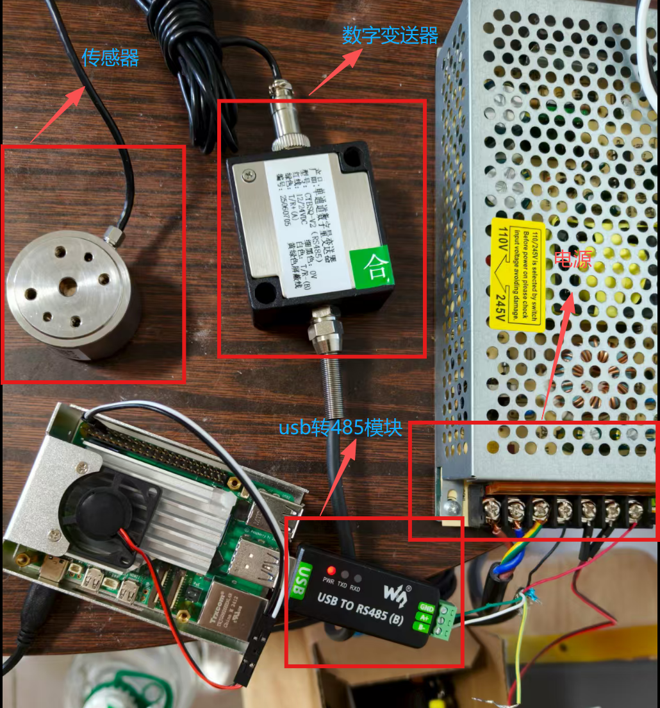
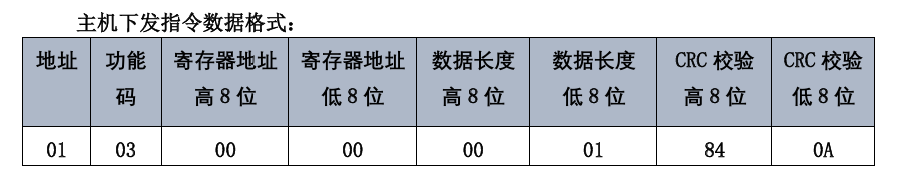
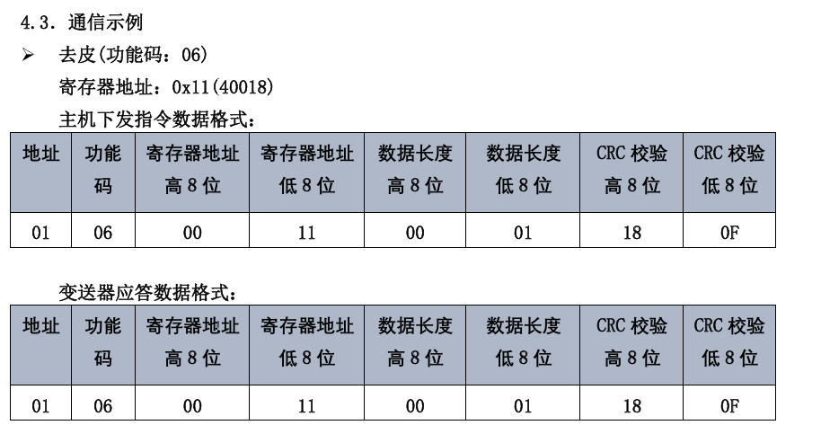
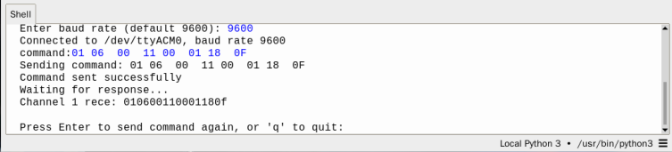
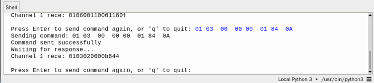

# 扭矩传感器

本文记录扭矩传感器接入树莓派后的实际调试流程：硬件接线、USB 转 RS485 识别、Modbus RTU 手动读值、去皮调零，以及施加扭矩后的数值变化验证。设备为 CYBSQ-V2（RS485）数字变送器，对应 BSQ-DG-V2 协议说明书；本次使用树莓派串口 `/dev/ttyACM0`，参数为 9600 baud、8N1、Modbus 地址 1。

> 本文只把已经实测的步骤写成“已完成”。连续采集、N·m 换算和标定仍需后续根据说明书与实物参数补充。

## 一、设备与数据链路

| 设备 | 作用 |
| --- | --- |
| 扭矩传感器 | 电阻应变桥，输出毫伏级模拟差分信号 |
| CYBSQ-V2 / BSQ-DG-V2 数字变送器 | 为传感器提供桥路激励，并将模拟信号转换为 Modbus RTU |
| USB 转 RS485 模块 | 将 RS485 接口转换为树莓派 USB 串口 |
| 树莓派 | 运行 Python 串口交互环境并发送 Modbus 指令 |
| 24V 开关电源 | 为数字变送器及传感器供电 |
### 1.1 传感器主要参数

- 额定量程：20 N·m，可测正、反两个扭矩方向
- 测量范围：-20.0～+20.0 N·m
- 显示分辨率：0.1 N·m
- 通信方式：RS485，Modbus RTU

数据链路：

`扭矩传感器 -> 数字变送器 -> RS485 A/B -> USB 转 RS485 -> 树莓派`

## 二、硬件接线

### 2.1 传感器与数字变送器

扭矩传感器的航空插头直接插入数字变送器的传感器接口。不要拆开航空插头内部接线，接线前先断开电源。

### 2.2 数字变送器输出线

以下连接以变送器外壳标签为准：

| 线色 | 标签/作用 | 实际连接 |
| --- | --- | --- |
| 红色 | `12/24VDC`，电源正极 | 开关电源 `V+` |
| 黑色 | `0V`，电源负极 | 开关电源 `V-` |
| 绿色 | `T/R+(A)`，RS485 A | USB 转 RS485 `A+` |
| 白色 | `T/R-(B)`，RS485 B | USB 转 RS485 `B-` |
| 黄绿双色 | 屏蔽线 | 本次台架测试未接，单独绝缘 |

`A+` 和 `B-` 是 RS485 通信信号，不是电源正负极，不能接到开关电源的 `V+`、`V-`。

### 2.3 开关电源与树莓派

- 变送器允许 `12-30VDC`，本次使用 24V 直流系统。
- 开关电源交流侧按外壳上的 `L`、`N`、`PE/接地` 标识连接；若有 110/220V 选择开关，应置于 220/230V 档。
- 电源上重复的两个 `V+` 内部相通，两个 `V-` 内部相通；`L`、`N`、`PE`、`V+`、`V-` 不能混接。
- 树莓派使用独立 5V 适配器，24V 绝不能接入树莓派。
- USB 转 RS485 插入树莓派 USB 口。模块的 PWR 红灯只表示 USB 侧有电，不代表 RS485 通信已经成功。
- 实测过程中树莓派出现过低电压警告。正式采集前应检查 5V 适配器和电源线，因为低电压可能导致 USB 串口掉线。

## 三、树莓派软件准备

本次没有使用 Thonny，而是使用终端和 Python 交互环境完成测试。

安装 PySerial：

~~~bash
sudo apt install python3-serial
~~~

查询当前串口：

~~~bash
python3 -m serial.tools.list_ports
~~~

当时系统列出了 5 个串口，USB 转 RS485 被识别为：

~~~text
/dev/ttyACM0
~~~

实际使用时应以命令输出的端口为准，端口编号也可能因 USB 设备或插拔顺序变化。

桌面原有的 `rs485.py` 不是本流程使用的串口程序。它会循环发送无关帧 `01030806` 并显示 `No data`，不要用它测试本传感器；如果误启动，用 `Ctrl+C` 停止。

## 四、打开串口

在终端进入 Python：

~~~bash
python3
~~~

在 `>>>` 后输入：

~~~python
import serial
s = serial.Serial('/dev/ttyACM0', 9600, timeout=1)
~~~

本次串口参数如下：

| 参数 | 值 |
| --- | --- |
| 端口 | `/dev/ttyACM0` |
| 波特率 | 9600 |
| 数据格式 | 8N1（8 位数据位、无校验、1 位停止位） |
| Modbus 地址 | 1 |
| 读取超时 | 1 秒 |

如果打开串口时报权限错误，先确认当前用户是否有串口设备访问权限，并检查是否有其他程序占用该端口；不要直接把所有操作都改成 root。

## 五、读取当前测量值

### 5.1 读取指令

读取保持寄存器 40001（地址 `0x0000`）的 Modbus RTU 请求帧为：

~~~text
01 03 00 00 00 01 84 0A
~~~

> 下方协议图来自息流资料，用于核对帧格式；本次树莓派实际操作使用上面的 Python 命令，不依赖页面中的串口助手。

字段含义：

| 字节 | 含义 |
| --- | --- |
| `01` | 从站地址 1 |
| `03` | 读取保持寄存器 |
| `00 00` | 起始寄存器地址 `0x0000`，手册显示为 40001 |
| `00 01` | 读取 1 个寄存器 |
| `84 0A` | Modbus CRC，低字节在前 |

在 Python 中发送并读取 7 字节应答：

~~~python
s.write(bytes.fromhex('01 03 00 00 00 01 84 0A'))
s.read(7).hex()
~~~

`s.write(...)` 返回的数字 `8` 表示发送了 8 个字节，不是测量值。

标准应答格式：

~~~text
01 03 02 DATA_H DATA_L CRC_L CRC_H
~~~

其中 `DATA_H DATA_L` 是 16 位有符号整数。例如：

| 数据字节 | 有符号十进制 |
| --- | ---: |
| `00 1C` | 28 |
| `FF E4` | -28 |
| `FF FD` | -3 |

### 5.2 第一次实测结果

第一次读取返回：

~~~text
010302fffd3835
~~~

有效数据为 `FFFD`，按 16 位有符号整数解析为 `-3`。这说明通信链路已经成功，但空载时存在小零偏。

## 六、去皮/调零

“去皮”是把当前机械状态设置为零点。执行前应确保传感器无外加扭矩，或已经处于说明书规定的基准状态。去皮只改变零点偏置，不改变量程和灵敏度；说明书提示去皮值可能保存，因此不要反复执行。

去皮请求帧：

~~~text
01 06 00 11 00 01 18 0F
~~~

在 Python 中发送并读取 8 字节应答：

~~~python
s.write(bytes.fromhex('01 06 00 11 00 01 18 0F'))
s.read(8).hex()
~~~

本次实测返回：

~~~text
010600110001180f
~~~

应答与请求帧完全一致，去皮成功。去皮后再次发送读取指令，返回：

~~~text
0103020000b844
~~~

有效数据为 `0000`，空载零点恢复为 0。

## 七、施加扭矩并读取数值

去皮完成后，固定传感器一侧，对另一侧绕传感器中心轴施加并保持扭矩，然后发送读取指令：

~~~python
s.write(bytes.fromhex('01 03 00 00 00 01 84 0A'))
s.read(7).hex()
~~~

本次测试得到以下返回值：

~~~text
0103020000b844
010302ffffb9f4
0103020003f845
~~~

返回报文格式为：

~~~text
01 03 02 DATA_H DATA_L CRC_L CRC_H
~~~

其中第4、5字节 `DATA_H DATA_L` 是扭矩原始值，需要按照16位有符号整数解释：

- `0000` 表示原始值为0
- `FFFF` 表示原始值为-1
- `0003` 表示原始值为3

正负号表示两个相反的扭矩方向。

为了将原始值换算成 N·m，还需要读取变送器的小数点位数。读取小数点寄存器40002：

~~~python
s.write(bytes.fromhex('01 03 00 01 00 01 D5 CA'))
s.read(7).hex()
~~~

本次返回：

~~~text
01030200017984
~~~

有效数据为 `0001`，表示测量结果保留一位小数，因此：

~~~text
实际扭矩 = 原始值 ÷ 10
~~~

所以本次三个读数分别为：

- 原始值0，对应 `0.0 N·m`
- 原始值-1，对应 `-0.1 N·m`
- 原始值3，对应 `0.3 N·m`

读数随施加扭矩发生变化，证明传感器、数字变送器、RS485通信和树莓派读取均正常。

## 八、当前完成边界

已完成：

- 硬件接线和 24V 供电
- USB 转 RS485 设备识别
- 9600/8N1 串口通信
- Modbus RTU 手动读取
- 去皮调零
- 施加扭矩后原始值变化验证

尚未完成：

- 自动连续/实时采集
- 原始寄存器值到准确 `N·m` 的换算
- 量程、小数点、正负方向、线性和精度标定
- 数据保存、曲线显示或 ROS 集成

## 九、结束测试

在 Python 交互环境中关闭串口并退出：

~~~python
s.close()
exit()
~~~

如果需要关闭整机，建议按以下顺序：

1. 关闭并拔掉 24V 开关电源。
2. 在树莓派终端执行：
   ~~~bash
   sudo shutdown -h now
   ~~~
3. 等待树莓派完全关机，再断开树莓派 5V 电源和 USB 转 RS485。

## 十、问题排查

| 现象 | 检查顺序 |
| --- | --- |
| 找不到 `/dev/ttyACM0` | 重新插拔 USB 转 RS485，执行 `python3 -m serial.tools.list_ports`，确认端口编号；检查 USB 线和供电 |
| 打开串口时报 `PermissionError` | 检查用户串口权限，并确认没有其他串口程序占用设备 |
| 发送后没有回包 | 检查 24V 供电、航空插头、A/B 极性、设备地址 1 和实际串口；确认没有运行 `rs485.py` |
| 回包长度或内容不对 | 核对功能码、寄存器地址、字节数和 CRC；确认波特率为 9600、格式为 8N1 |
| 空载读到 `-3` 等小偏置 | 在无外加扭矩的基准状态下执行一次去皮，再重新读值 |
| 施加扭矩仍为 0 | 固定一侧并沿中心轴施加扭矩，保持受力后再读取；检查机械安装 |
| 数值比例不对 | 查说明书中的量程、小数点、符号和标定关系；不要凭经验把原始值改写成 `N·m` |

