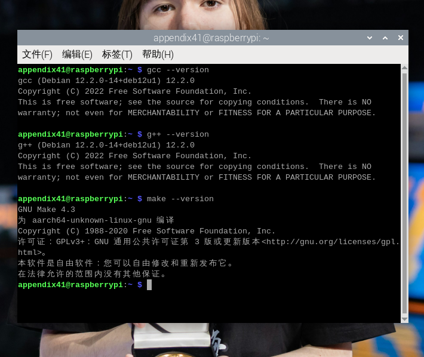
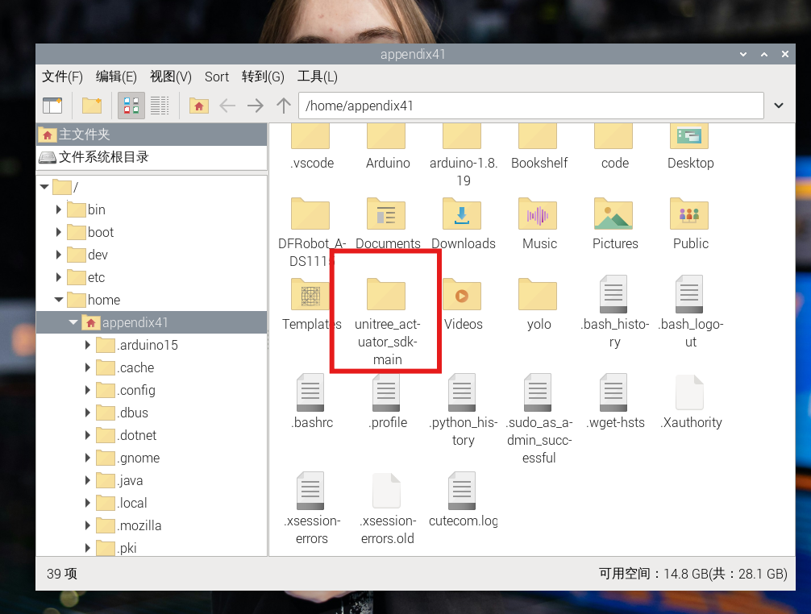
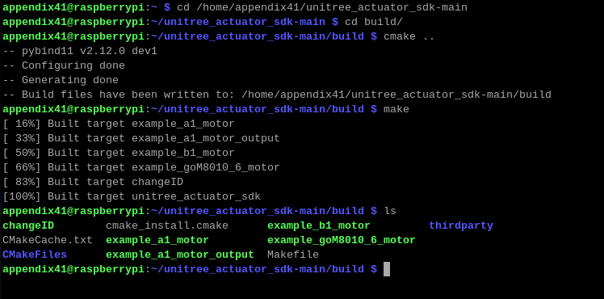
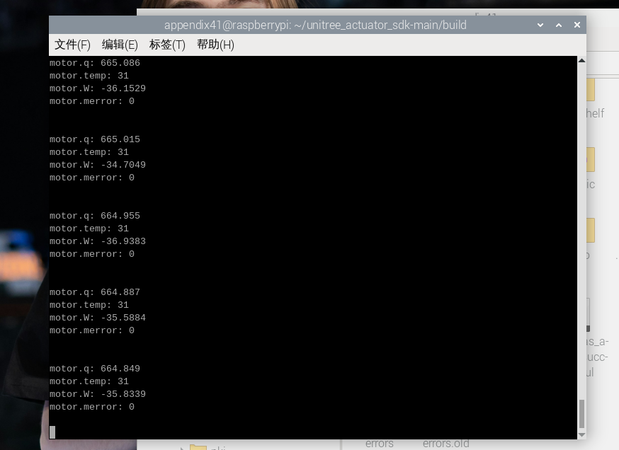
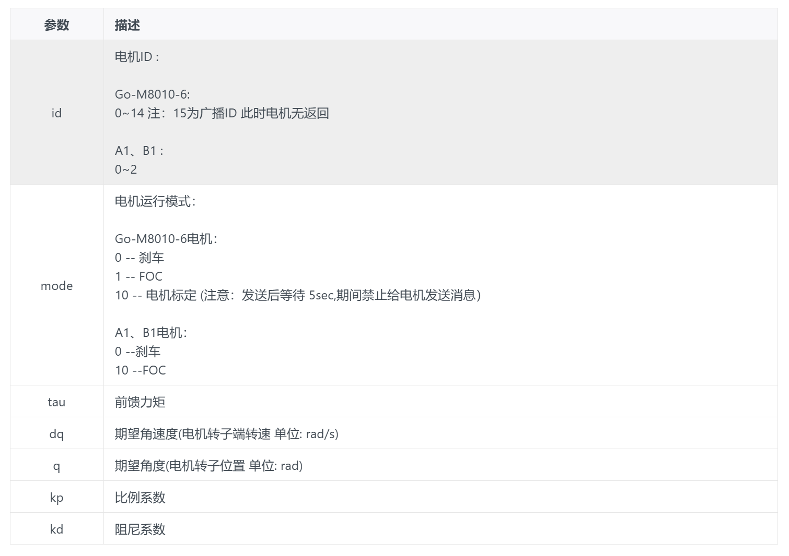

# 宇树科技 GO-M8010-6

本文记录 GO-M8010-6 电机按照息流教程在树莓派上的实际实现流程：确认供电和 RS-485 硬件链路、检查树莓派环境、使用已经存在的宇树官方 SDK、确认编译产物，并运行官方匀速旋转示例。

## 一、设备与目录

当前资料目录：

~~~text
宇树科技GO-M8010-6/
├─ README.md
└─ 图片/
   ├─ 环境配置.png
   ├─ SDK目录.png
   ├─ 编译结果.png
   ├─ 运行输出.png
   └─ 工作模式参数.png
~~~

官方 SDK 在树莓派用户目录中单独保存，不随本目录的 README 和图片一起提交。教程中使用的 SDK 路径为：

~~~text
/home/appendix41/unitree_actuator_sdk-main
~~~

设备关系：

| 设备 | 作用 |
| --- | --- |
| Unitree GO-M8010-6 电机 | 被控制并返回状态的执行器，内部集成驱动器、编码器和底层 FOC 控制 |
| USB 转 RS-485 模块 | 将树莓派 USB 接口转换为半双工 RS-485 |
| GH1.25-3 线 | 连接 USB 转 RS-485 模块和 XT30 转接板 |
| XT30(2+2) 转接板 | 连接通信线和 24V 电源 |
| 24V 直流电源 | 为电机供电 |
| 树莓派 | 运行 C++ SDK 示例并通过 USB 发送控制命令 |

## 二、硬件连接

标准连接链路：

~~~text
树莓派 USB 口
  -> 宇树 USB 转 RS-485 模块
  -> GH1.25-3 线
  -> XT30(2+2) 转接板
  -> XT30(2+2) 线
  -> GO-M8010-6 电机

24V 直流电源
  -> XT30(2+2) 转接板电源输入端
~~~

电机供电范围为 `12-30V DC`，官方推荐使用 24V，禁止超过 30V。电机电源和树莓派供电相互独立，树莓派只负责通信。

> 附件记录的是实际接线：USB-RS485 模块通过 GH1.25-3 线接 XT30(2+2) 转接板，再连接电机；24V 直流电源接转接板的电源输入端。资料没有按黑、白等线色明确标定电源极性，重新接线时必须以转接板、接头上的 `+/-` 标识或万用表测量结果为准。

接好并上电后，电机绿色指示灯闪烁，表示电机已经开机。首次通电前应确认：

- 电机已经机械固定，输出端没有人员、线缆或其他障碍物；
- 24V 电源极性和电压正确；
- USB 转 RS-485 模块与转接板的通信线连接可靠；
- 能够在异常情况下立即关闭 24V 电源。

## 三、检查树莓派环境

### 1. 安装开发工具

本次执行过：

~~~bash
sudo apt update
sudo apt install build-essential
~~~

`build-essential` 提供 GCC、G++、Make 以及编译 C/C++ 程序所需的基础开发文件。

### 2. 检查版本

~~~bash
gcc --version
cmake --version
git --version
~~~

本次记录的版本为：

| 工具 | 实测版本 |
| --- | --- |
| GCC | 12.2.0 |
| CMake | 3.25.1 |
| Git | 2.39.5 |
| build-essential | 12.9，已是最新版 |

### 3. 检查系统架构

~~~bash
uname -m
~~~

本次输出：

~~~text
aarch64
~~~

因此使用 SDK 中的 ARM64 动态库：

~~~text
lib/libUnitreeMotorSDK_Arm64.so
~~~

如果输出为 `armv7l` 或 `armhf`，不能直接假设 SDK 中的预编译库兼容，应先确认对应架构的库文件。

## 四、获取和检查官方 SDK

官方仓库：

[unitreerobotics/unitree_actuator_sdk](https://github.com/unitreerobotics/unitree_actuator_sdk)

如果树莓派上没有 SDK，可以尝试：

~~~bash
cd ~
git clone https://github.com/unitreerobotics/unitree_actuator_sdk.git unitree_actuator_sdk-main
~~~

本次树莓派无法连接 GitHub 的 443 端口，`git clone` 下载失败；但 `/home/appendix41/unitree_actuator_sdk-main` 已经存在，因此继续使用已有目录，没有影响后续运行。

SDK 目录中应能看到：

~~~text
unitree_actuator_sdk-main/
├─ CMakeLists.txt
├─ include/       # SDK 接口声明
├─ lib/           # 预编译通信库
├─ example/       # 官方 C++ 示例
├─ motor_tools/   # 电机 ID、模式等工具
├─ python/        # Python 接口和示例
├─ thirdparty/
└─ build/         # 编译输出
~~~

SDK 主要负责：

- 将电机 ID、模式、角度、速度、力矩、刚度和阻尼参数封装成数据包；
- 计算通信帧 CRC；
- 通过串口发送命令并接收反馈；
- 解析角度、速度、力矩、温度和故障码。

如果没有 SDK，就需要自行构造通信报文；本教程不建议把手工发裸帧作为常规控制方法。

## 五、确认 USB 串口与通信参数

插入 USB 转 RS-485 模块后执行：

~~~bash
ls /dev/ttyUSB*
~~~

本次识别结果：

~~~text
/dev/ttyUSB0
~~~

官方 `example/example_goM8010_6_motor.cpp` 默认打开：

~~~cpp
SerialPort serial("/dev/ttyUSB0");
~~~

如果系统识别为 `/dev/ttyUSB1` 或其他设备名，应修改示例中的端口路径后重新编译，不能把 `/dev/ttyUSB0` 当成所有设备的固定编号。

本次教程参数：

~~~text
通信接口：半双工 RS-485
波特率：4000000 bit/s
数据格式：8N1
默认电机 ID：0
~~~

这些是本次教程示例参数。更换电机、转换器、SDK 版本或修改电机 ID 后，应重新核对说明书和示例配置。

示例通信帧可能类似：

~~~text
发送：FE EE 10 00 00 53 06 00 00 00 00 00 00 0C 00 4A 83
反馈：FD EE 10 00 00 FB FF 93 7A 00 00 22 A0 0E AE 17
~~~

裸帧只用于理解协议和排查通信，不要在电机未固定、供电未确认或没有急停条件时手工发送。

## 六、编译官方示例

首次获得未编译的 SDK 时，在工程根目录执行：

~~~bash
cd /home/appendix41/unitree_actuator_sdk-main
mkdir build
cd build/
cmake ..
make
~~~

命令作用：

- `mkdir build`：创建独立的编译输出目录；
- `cmake ..`：读取上一级目录的 `CMakeLists.txt`，生成编译规则；
- `make`：编译示例并链接 SDK 动态库。

本次树莓派中的 `build/` 和可执行程序已经由之前的使用者编译完成，因此本次没有重新执行上述编译命令。使用下面的命令确认现有产物：

~~~bash
find ~/unitree_actuator_sdk-main/build -maxdepth 1 -type f -executable -printf "%f\n"
~~~

输出包含：

~~~text
example_goM8010_6_motor
example_a1_motor
example_a1_motor_output
example_b1_motor
changeID
~~~

本流程只使用：

~~~text
example_goM8010_6_motor
~~~

A1、B1 示例和 `changeID` 本次均未运行。

## 七、运行 GO-M8010-6 官方示例

进入编译结果目录：

~~~bash
cd ~/unitree_actuator_sdk-main/build
ls
~~~

运行 GO-M8010-6 示例：

~~~bash
sudo ./example_goM8010_6_motor
~~~

`sudo` 用于访问 `/dev/ttyUSB0`；如果当前用户已经具有串口访问权限，也可以根据实际权限配置决定是否需要管理员权限。

运行该命令会实际发送电机控制帧。第一次调试应使用空载、低速、短时间测试，并确保可以立即切断电机电源。

官方示例内部循环调用 SDK，通过 RS-485 向 ID 0 的电机持续发送速度控制命令。教程目标输出端速度约为每秒 1 圈。本次运行时电机正常匀速旋转，终端持续打印状态，说明以下链路已经打通：

~~~text
树莓派
  -> USB 转 RS-485
  -> GO-M8010-6 通信
  -> Unitree SDK 示例程序
  -> 电机执行与状态反馈
~~~

示例输出字段：

~~~text
motor.q:      # 电机角度
motor.temp:   # 电机温度
motor.W:      # 角速度，示例字段对应 data.dq
motor.merror: # 电机错误码
~~~

`motor.merror: 0` 表示该次反馈没有报告电机错误。

## 八、停止行为与安全操作

本次观察到：按 `Ctrl+C` 后，终端程序停止刷新，但电机仍可能继续执行最后一次速度命令。息流教程没有提供退出前发送停止命令的实现，因此不能把 `Ctrl+C` 当作唯一的电机停止措施。

如果电机没有停止：

1. 立即关闭 24V 电源；
2. 确认电机完全停止后，再处理 USB、转接板和机械结构；
3. 记录终端输出和 `motor.merror`，再排查原因。

不要只关闭终端窗口而让电机继续带电运行。首次调试建议空载、低速、短时间运行，并始终准备直接断电或急停。

## 九、控制参数和工作模式

官方示例涉及的控制参数包括：

| 参数 | 含义 |
| --- | --- |
| `id` | 电机 ID；教程示例使用 0，15 为广播 ID |
| `mode` | 运行模式；教程参数表列出 `0` 刹车、`1` FOC、`10` 电机标定 |
| `tau` | 前馈力矩 |
| `dq` | 期望角速度，单位 `rad/s` |
| `q` | 期望角度，单位 `rad` |
| `kp` | 比例系数 |
| `kd` | 阻尼系数 |

模式 `10` 标定命令发送后，教程提示应等待约 5 秒，期间不要继续发送消息。工作模式表只能作为参数对照，切换模式前必须阅读对应用户手册。

本次只验证了官方 FOC 匀速示例，没有验证位置、速度、阻尼、力矩、零力矩或力位混合等扩展控制，也没有编写自定义控制程序。

## 十、本次完成状态

已完成：

- GO-M8010-6 与 XT30(2+2) 转接板、USB 转 RS-485 的连接；
- 24V 供电，电机绿色指示灯闪烁；
- `/dev/ttyUSB0` 串口识别；
- `aarch64` 系统架构确认；
- GCC、CMake、Git 和 `build-essential` 检查；
- SDK 目录和 ARM64 动态库确认；
- 已有编译产物检查；
- 官方 `example_goM8010_6_motor` 运行；
- 电机匀速旋转和状态反馈观察。

本次没有完成：

- 重新下载或重新编译 SDK；
- 自定义角度、速度或力矩控制；
- 电机 ID 修改；
- 软件停止命令和安全退出逻辑；
- 长时间可靠性、负载性能和精度测试。

## 十一、问题排查

| 现象 | 检查顺序 |
| --- | --- |
| 找不到 `/dev/ttyUSB0` | 重新插拔 USB 转 RS-485，执行 `ls /dev/ttyUSB*`，检查 USB 线、模块供电和设备权限 |
| `git clone` 失败 | 确认树莓派网络和 GitHub 443 端口；如果 SDK 目录已存在，先检查 `CMakeLists.txt`、`lib/`、`example/` 和 `build/` 是否完整 |
| `cmake ..` 找不到库 | 执行 `uname -m`，确认 `lib/libUnitreeMotorSDK_Arm64.so` 存在，并从 SDK 根目录进入 `build/` 编译 |
| 找不到 `example_goM8010_6_motor` | 确认 `make` 完整结束，进入 `build/` 执行 `ls -l example_goM8010_6_motor` |
| 程序打不开串口 | 检查端口是否仍为 `/dev/ttyUSB0`、当前用户权限和其他串口程序占用情况 |
| 电机不动 | 检查 24V 供电、绿色指示灯、RS-485 接线、默认 ID 0、示例端口路径和急停状态 |
| 电机抖动或高速旋转 | 立即关闭 24V；检查 `mode`、`dq`、`q`、`kp`、`kd` 和机械安装，不要继续盲目试错 |
| `motor.merror` 非 0 | 立即停止并记录完整反馈，根据官方手册解释错误码，不要忽略错误 |
| 按 `Ctrl+C` 后电机仍运行 | 这是本次观察到的行为，直接关闭 24V 电源；不要把终端退出当作电机停止命令 |
